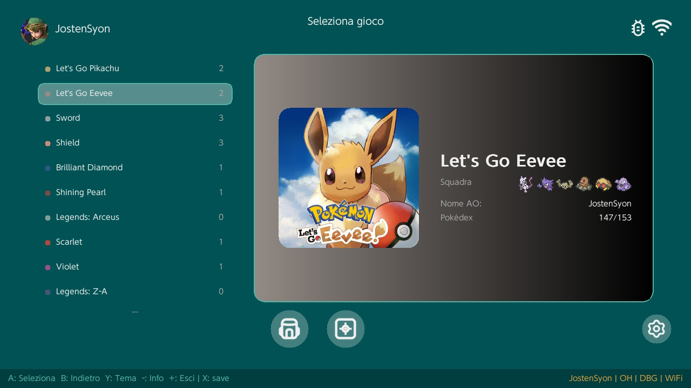
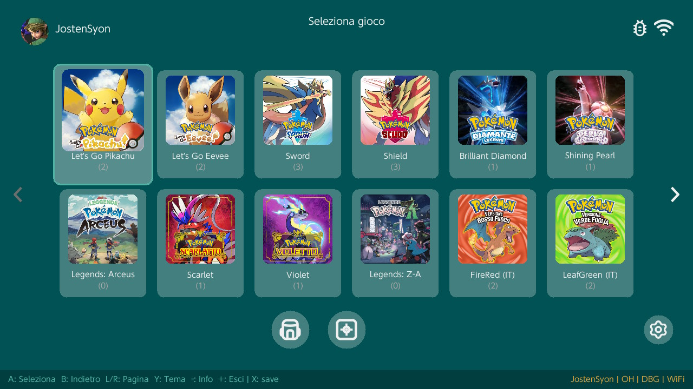
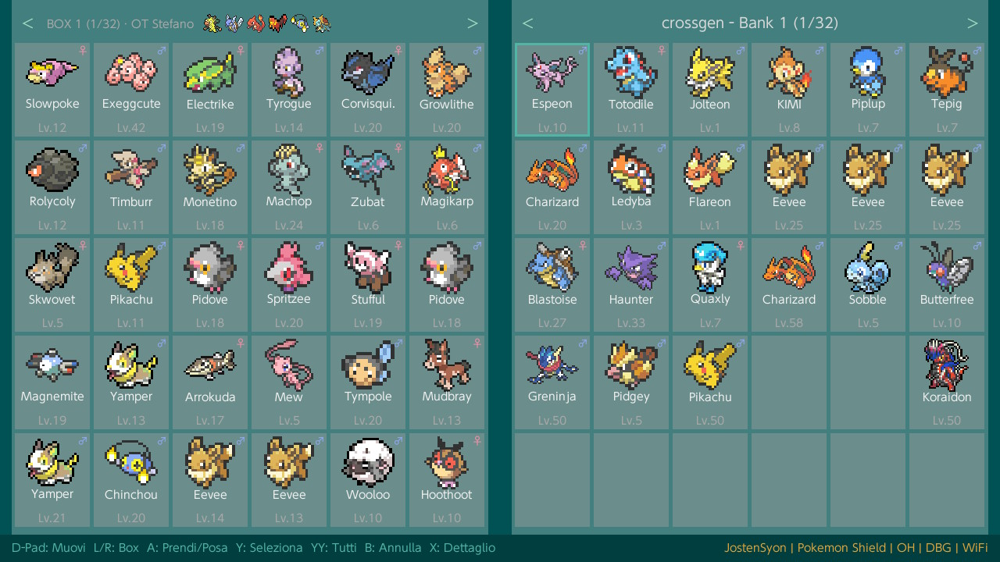
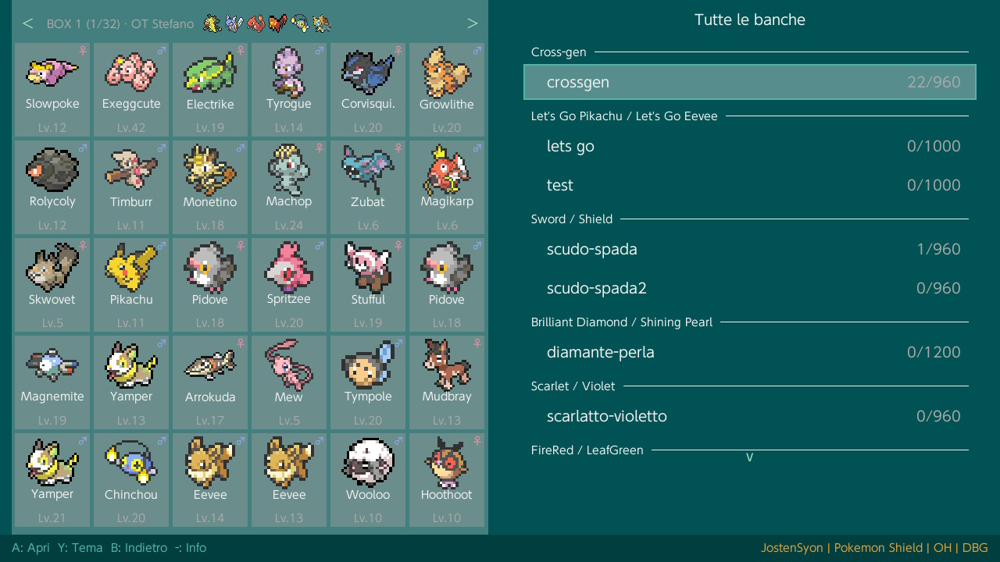

# OpenHomeNX

**English** · [Italiano](#openhomenx-italiano)

Box manager and cross-generation transfer for Pokémon saves, on **Nintendo Switch** (homebrew `.nro`) and **R36S/ArkOS** (native Linux port).

Started from **pkHouse**'s box/bank grid concept (C++/SDL2) — that's where the idea for the two-panel box UI came from — combined with the **OpenHome** backend (Rust via FFI) for real cross-gen transfer. Everything else (bank management, backpack, remote sync, boxart, ROM launcher, the whole R36S port) has since been built out independently. Failures are always explicit, never silent.

## Screenshots






## Features

- Two-panel box viewer, pick & place, multi-select, ZL/ZR box view, persistent reorderable dock
- Pokémon details, search/filters, learnset viewer, 9 themes, 12 languages
- Gallery view with per-game preview: party, Pokédex progress, play time
- Real cross-gen transfer across 13 formats (gen 1–9, PA8/PA9/PB8/PB7) with
  explicit dex-cut and move-drop, OHPKM tracking for lossless return
- Party strip with OT, grab/swap/place from party, compaction on save
- Self-trade: evolve trade-only Pokémon (incl. held-item and paired evolutions) without a second player
- Backpack / item editing across generations (Gen 1/2 GB, Gen 3 RSE/FRLG, Gen 4/5 DS)
- Boxart: local cover art first, automatic 2D/3D download fallback via ScreenScraper.fr (libretro-thumbnails as backup), per-style cache, background update with live progress and instant cancel
- Browse and launch your whole ROM library, saves or not: "Show ROMs without save" lists every scanned GBA/GBC/GB ROM even before you've ever played it — box/backpack/trade stay hidden until a real save exists, but the tile is always there and launchable
- Launch imported GBA/GBC/GB ROMs straight from their save (mGBA on Switch, RetroArch on R36S)
- ROM rename from cartridge header (real game name + detected language)
- Native GB/GBC/GBA/DS/decrypted-3DS saves + SD/USB import
- LAN remote sync with Filebrowser-compatible devices (R36S/ArkOS…): send/receive/auto-sync saves and ROMs
- Wondercard injection, automatic save backups, LED, network indicator
- Self-update from SD/GitHub releases; optional Home Menu shortcut (Switch)

## Cross-gen bank (flagship)

Any Pokémon can be moved between any supported save via the cross-gen bank (`banks/All/` or per-family with `banks/<Family>/`). Conversion goes through OHPKM in Rust: PID re-rolled to keep nature/ability/gender/shininess, dex-cut and 4-move drop are shown explicitly (`A: proceed / B: cancel`), and `OriginalBackup` keeps the initial bytes for a lossless return. No silent failures — `transfer_cant_read_src` etc.

## Backpack (item editing)

Item editing per generation, not just Pokémon: Gen 1/2 (GB bags), Gen 3 (RSE/FRLG), Gen 4/5 (DS) — gift and take back items (stack to max, key items protected), full anomaly scan (invalid/over-max/protected) with a journal and one-tap fixes. Per-game event items (National Dex, Eon Ticket, Mystery Event…) are tracked as pure save flags instead of fake bag items: take one back and the event is actually disabled again, not just hidden from the bag.

## Self-trade evolution

Evolve trade-evolution Pokémon (Kadabra, Machoke, Graveler, Haunter, and the held-item lines like Electabuzz/Magmar/Porygon2/Rhydon, plus paired evolutions like Karrablast/Shelmet) without needing a second console or a friend to trade with and give back. Picks an eligible Pokémon from the party, checks the held item / counterpart requirement, shows exactly what's traded away and what comes back, and evolves it in place on confirm — nothing simulated behind the scenes, the same rules PKHeX documents.

## Boxart (cover art)

Three styles for the game selector art, switchable anytime: **Locale** (use whatever a local scraper already put in `images/`, or your own bundled/local art; falls back to a 2D download only if nothing local exists, and always keeps the game's name visible on that fallback so it's never mistaken for real local art), **2D** (always download, box art only), **3D** (real 3D box art via ScreenScraper.fr, falls back to 2D and logs it — the fallback is never cached in a way that blocks a real 3D cover from being found later). Downloads run on a background thread with a live progress bar and instant `B`-to-cancel — the app never freezes while fetching. Screenshots/logos/marquees are never picked as cover art. Cached per style so switching styles shows different art immediately, without re-downloading what's already cached under another style; a failed fetch is remembered for an hour so a bad connection doesn't get re-hammered on every update, but a cancelled attempt never counts as a failure.

## ROM launcher

Launch any imported GBA/GBC/GB ROM directly, with or without a save yet — see "Show ROMs without save" above. When a save exists, OpenHomeNX resolves the matching ROM by filename next to it (`.gb`/`.gbc`/`.gba`, case-insensitive) automatically. On Switch it chainloads mGBA (`sdmc:/switch/mGBA.nro`) via `envSetNextLoad`; on R36S it hands off to RetroArch with the mGBA core and relaunches OpenHomeNX automatically once you're done playing.

## Remote sync (LAN)

Box Remoto and DevSync talk to any Filebrowser-compatible device on the LAN (R36S/ArkOS and similar): browse and open saves directly from the remote device, or send/receive/auto-sync between the Switch and it. Auto-sync direction is decided from real progress — play time first, then Pokédex catches — never a blind file timestamp, so a save just received over the network isn't mistaken for "newer".

## Supported games

| Family | Games | Via |
|---|---|---|
| Switch | Scarlet / Violet (4.0.0), Sword / Shield (1.3.2), BDSP (1.3.0), Legends Arceus (1.1.1), Legends Z-A (2.0.2), Let's Go Pikachu/Eevee (1.0.2), FireRed/LeafGreen (incl. ES/DE/IT/FR/JA) | Installed save (`AccountManager`) |
| 3DS (decrypted, import) | X / Y, Omega Ruby / Alpha Sapphire, Sun / Moon, Ultra Sun / Ultra Moon | SD/USB file |
| GBA (import) | Ruby / Sapphire / Emerald, FireRed / LeafGreen | SD/USB file |
| GB (import) | Red / Blue / Yellow, Gold / Silver / Crystal | SD/USB file |
| DS (import) | Diamond / Pearl / Platinum / HGSS, Black / White / B2W2 (save write-back) | SD/USB file |

FireRed/LeafGreen is the only family that can show up either way: as an installed Switch save *or* as an imported GBA file (R36S always uses the import path, since there's no installed-title concept there) — both are detected and handled per-instance, never assumed from the game type alone. If you own both (e.g. the NSO title on Switch and a matching ROM for R36S), **Settings → Data → Sync FRLG saves** copies whichever side has more play time onto the other — one-tap button, automatic backup on both sides first, optional "Auto-sync FRLG" toggle (off by default). Switch only, since R36S has no installed-title concept to sync against.

Cross-gen bank covers all 13 stored formats (PK1/PK2/PK3/PK4/PK5/PK6/PK7/PK8/PK9/PA8/PA9/PB8/PB7).

## Install (Switch)

1. Requires a Switch running a homebrew environment (e.g. Atmosphère + hbmenu) — same as any `.nro`.
2. Download `OpenHomeNX.nro` from the latest [release](../../releases) and copy it to
   `sdmc:/switch/OpenHomeNX/OpenHomeNX.nro` (or launch from hbmenu).
3. Start a Pokémon game at least once (creates the save), then open the app.
4. Later updates: `+` menu → *Check for update* (SD or network).

## Install (R36S/ArkOS)

1. Download `OpenHomeNX-r36s-vX.Y.Z.zip` from the latest [release](../../releases).
2. Extract it directly onto the SD card root (via card reader or network share) — it merges into the existing `home/`, `roms/tools/` and `roms/ports/` folders, no terminal needed.
3. Launch it from EmulationStation, Tools or Ports section ("OpenHomeNX").

## Main controls

| Button | Action |
|---|---|
| A | Pick / place |
| B | Cancel / return |
| X | Details (Y = moves in details) |
| Y | Multi-select |
| `-` | Release (hand or details) / About |
| `+` | Menu (themes, language, update, wondercard…) |
| L/R | Previous/next box |
| ZL/ZR | Box overview |
| Stick/D-Pad up | Reach the header party |

## Import (emulators) — already scanned

* `sdmc:/switch/OpenHomeNX/import/` is always scanned (created if missing); on R36S, `/roms/gba`, `/roms/gbc`, `/roms/gb` are scanned by default.
* Extra folders: **Settings → Data → Cartelle import** → `+ Add path…` (any `sdmc:/…`/`usb:/…` on Switch, any absolute path on R36S), enable/disable per path.
* USB autocheck (Switch, optional): **Settings → Data → Autocheck save su USB** scans every mounted drive's `/roms/saves` and `/roms` on hotplug — Ruby/Sapphire/Emerald, GB/GBC/GBA/DS saves are picked up without manual path.
* Rescan: **Settings → Data → Scansiona import** or replug drive.

## USB peripherals (Switch)

USB drives via `libusbhsfs` (FAT-only, ISC build in `libusbhsfs/lib`). Hotplug detected, safe eject via trash icon or `Y` in game selector, LED + `debug.log` hints (`physical>0 mounted==0` → MBR/FS issue). Backups and import both work from USB; update can also be fetched from `usb:/switch/OpenHomeNX/update/` or network.

## Backups — 1-click restore

* **Auto**: once per game load, full copy under `backups/<profile>/<game>/<profile>_YYYY-MM-DD_HH-MM-SS/` (2× free-space check, soft-cancel). Pruned by cap (`Settings → Data → Max backup auto`, default 256 MB SD / 32 MB).
* **Manual**: `X` on a game (debug off: `Y` → `Backup save` / `Browse backups` / `Clean old backups`). Any entry (`[AUTO]`/`[MAN]`) restores with one `A` → `Restore backup` → `A: Confirm`, overwriting the current save.

## Self-update (integrated)

No manual copy needed. `+` → *Check for update* looks for a newer `OpenHomeNX.nro` in `sdmc:/switch/OpenHomeNX/update/`, on any mounted USB (`usb:/switch/OpenHomeNX/update/`), and on the network if `update.cfg` (`url=…/latest.json`) is set. Network fetch shows `latest.json { version, nro, sha256 }`, downloads to `OpenHomeNX.nro.new` and chainloads via `envSetNextLoad` on next exit. Also checked silently on boot.

## Debug extras — party

With **Settings → Debug → Funzioni Debug ON**, the header party strip becomes movable: `D-Pad Up` reaches the 6 party slots, `A` pick/place/swap, `Y` duplicate check, empty party auto-fills Caterpie/Magikarp placeholder (prompt). Otherwise party is read-only and compacted on save.

## Build from source

### Switch

Requires: devkitPro + devkitA64 + libnx (portlibs: SDL2, SDL2_image,
SDL2_ttf, curl…), Rust nightly (target `aarch64-unknown-none`,
see `rust/.cargo/config.toml`).

```sh
./release.sh          # build + dist/OpenHomeNX.nro + dist/latest.json
./release.sh serve    # as above + local server for the network updater
```

Plain `make` compiles without packaging. Never copy `.nro` into `dist/` by hand.

### R36S/ArkOS

Cross-compiled for aarch64-linux-gnu via Docker (no toolchain to install locally beyond Docker itself):

```sh
cd platform/r36s
./build_linux.sh                    # build only -> platform/r36s/OpenHomeNX
./build_linux.sh 192.168.x.x        # build + deploy over SSH to a device (dev workflow)
./package_r36s.sh                   # build + dist/OpenHomeNX-r36s-vX.Y.Z.zip (release)
```

Rust tests run on the host (never on the Switch):

```sh
cd rust && cargo +nightly test -p openhome_switch --features std \
  --target aarch64-apple-darwin
```

## Layout

```
source/ include/   C++ frontend (shared by both platforms) + FFI wrappers
platform/r36s/     R36S/ArkOS port: Docker toolchain, libnx shims, stubs
rust/              Rust workspace (openhome_switch + vendored pkm_rs)
romfs/             sprites, fonts, strings, boxart
tools/             save utilities, test fixtures, R36S launcher script
deploy_r36s.sh     clean build + SSH deploy to a R36S device (dev workflow)
```

## Credits

OpenHomeNX would not exist without these projects — thanks to the authors and
communities maintaining them:

- **[pkHouse](https://github.com/Insektaure/pkHouse)** by Insektaure —
  original idea for the two-panel box/bank grid that OpenHomeNX started from; UI, layout and everything beyond that starting point have since been built out independently
- **[OpenHome](https://github.com/andrewbenington/OpenHome)** by andrewbenington —
  Rust backend (cross-gen conversions, formats, crypto)
- **[PKHeX](https://github.com/kwsch/PKHeX)** by kwsch — reference for
  save-format specifications
- **[Sphaira](https://github.com/ITotalJustice/sphaira)** by ITotalJustice —
  on-device forwarder design (NCA/PFS0/IVFC builder + ncm/ns install flow) adapted for the built-in launcher
- [libnx](https://github.com/switchbrew/libnx) / devkitPro — Switch toolchain

## License

GNU GPL v3 (`LICENSE`). Combines GPLv2 code (pkHouse) with GPL-3.0+ code
(OpenHome): the combined work is distributed under GPL v3.

## Disclaimer

Amateur project, not affiliated with or endorsed by Nintendo, Creatures Inc.,
GAME FREAK, The Pokémon Company, or the authors of the projects above.
Pokémon © Nintendo/Creatures Inc./GAME FREAK inc. Use only with legitimately
owned game copies; always back up your saves.

---

# OpenHomeNX (Italiano)

[English](#openhomenx) · **Italiano**

Box manager e trasferimento cross-generazione per save Pokémon, su **Nintendo Switch** (homebrew `.nro`) e **R36S/ArkOS** (porting nativo Linux).

Nato dall'idea della griglia box/banche a due pannelli di **pkHouse** (C++/SDL2) — è da lì che viene il concept dell'interfaccia — unito al backend di **OpenHome** (Rust via FFI) per il trasferimento cross-gen reale. Tutto il resto (gestione banche, zaino, sync remota, copertine, launcher ROM, l'intero porting R36S) è stato scritto in proprio da allora. I fallimenti sono sempre espliciti, mai silenziosi.

## Screenshot


## Funzioni

- Box viewer a due pannelli, pick & place, multi-selezione, box view ZL/ZR, dock persistente riordinabile
- Dettaglio Pokémon, ricerca/filtri, learnset viewer, 9 temi, 12 lingue
- Vista Galleria con anteprima per gioco: squadra, avanzamento Pokédex, tempo di gioco
- Transfer cross-gen reale su 13 formati (gen 1–9, PA8/PA9/PB8/PB7) con
  dex-cut e move-drop espliciti, tracking OHPKM per il ritorno lossless
- Party strip con OT, grab/swap/posa dal party, compattamento al salvataggio
- Self-trade: evola i Pokémon che evolvono solo per scambio (incl. oggetto in mano ed evoluzioni in coppia) senza bisogno di un secondo giocatore
- Zaino / modifica oggetti multi-generazione (Gen 1/2 GB, Gen 3 RSE/FRLG, Gen 4/5 DS)
- Copertine: arte locale prima, download automatico 2D/3D di fallback via ScreenScraper.fr (libretro-thumbnails di riserva), cache per stile, aggiornamento in background con progresso live e annullamento immediato
- Sfoglia e avvia tutta la libreria ROM, con o senza save: "Mostra ROM senza save" elenca ogni ROM GBA/GBC/GB scansionata anche prima di averci mai giocato — banca/zaino/scambio restano nascosti finché non esiste un save vero, ma la tile c'è sempre ed è sempre avviabile
- Avvia le ROM GBA/GBC/GB importate direttamente dal loro save (mGBA su Switch, RetroArch su R36S)
- Rinomina ROM dall'header della cartuccia (nome reale del gioco + lingua rilevata)
- Save nativi GB/GBC/GBA/DS/3DS-decifrati + import da SD/USB
- Sync remoto via LAN con dispositivi compatibili Filebrowser (R36S/ArkOS…): invia/ricevi/sincronizza save e ROM
- Wondercard injection, backup automatici dei save, LED, indicatore rete
- Self-update da SD/release GitHub; scorciatoia Home Menu opzionale (Switch)

## Banca cross-gen (punto forte)

Qualsiasi Pokémon può passare tra tutti i save supportati via banca cross-gen (`banks/All/` o per famiglia `banks/<Famiglia>/`). La conversione passa dall'OHPKM Rust: PID ricalcolato per mantenere natura/abilità/sesso/cromaticità, dex-cut e taglio a 4 mosse mostrati espliciti (`A: procedi / B: annulla`), `OriginalBackup` conserva i byte iniziali per il ritorno lossless. Mai silenzioso — errori `transfer_cant_read_src` ecc.

## Zaino (modifica oggetti)

Modifica oggetti per ogni generazione, non solo Pokémon: Gen 1/2 (borse GB), Gen 3 (RSE/FRLG), Gen 4/5 (DS) — regala e riprendi oggetti (fino al massimo dello stack, oggetti chiave protetti), scansione anomalie completa (non validi/oltre il massimo/protetti) con giornale e fix in un tocco. Gli oggetti-evento per gioco (National Dex, Biglietto Eone, Evento Misterioso…) sono tracciati come flag puri sul save invece che come falsi oggetti in borsa: riprendendoli l'evento viene davvero disattivato, non solo tolto dalla vista.

## Evoluzione self-trade

Evolvi i Pokémon che evolvono solo per scambio (Kadabra, Machoke, Graveler, Haunter, e le linee con oggetto in mano come Electabuzz/Magmar/Porygon2/Rhydon, oltre alle coppie come Karrablast/Shelmet) senza bisogno di una seconda console o di un amico a cui scambiare e farsi ridare il Pokémon. Scegli un Pokémon idoneo dal party, viene controllato l'oggetto in mano o la presenza del corrispondente, ti viene mostrato esattamente cosa viene scambiato via e cosa torna, ed evolve sul posto alla conferma — niente di simulato dietro le quinte, le stesse regole documentate da PKHeX.

## Copertine (boxart)

Tre stili per l'arte del selettore giochi, cambiabili in ogni momento: **Locale** (usa quello che uno scraper locale ha già messo in `images/`, o la tua arte già inclusa/locale; scarica il 2D solo se non esiste nulla di locale, e tiene sempre visibile il nome del gioco su quel fallback così non viene mai scambiato per arte locale vera), **2D** (sempre download, solo box art), **3D** (arte 3D vera via ScreenScraper.fr, fallback su 2D con log — il fallback non viene mai messo in cache in un modo che blocchi la ricerca futura di un vero box 3D). I download girano su un thread in background con barra di progresso live e annullamento immediato con `B` — l'app non si blocca mai durante lo scaricamento. Screenshot/loghi/banner non vengono mai scelti come copertina. Cache separata per stile, così cambiare stile mostra subito arte diversa senza dover riscaricare quello già in cache per un altro stile; un tentativo fallito viene ricordato per un'ora così una rete instabile non viene martellata a ogni aggiornamento, ma un annullamento non conta mai come fallimento.

## Launcher ROM

Avvia qualsiasi ROM GBA/GBC/GB importata, con o senza save — vedi "Mostra ROM senza save" sopra. Quando un save esiste, OpenHomeNX risolve automaticamente la ROM corrispondente dal nome file accanto ad esso (`.gb`/`.gbc`/`.gba`, case-insensitive). Su Switch fa il chainload di mGBA (`sdmc:/switch/mGBA.nro`) via `envSetNextLoad`; su R36S passa la mano a RetroArch con il core mGBA e rilancia OpenHomeNX automaticamente al termine della partita.

## Sync remoto (LAN)

Box Remoto e DevSync parlano con qualsiasi dispositivo compatibile Filebrowser sulla LAN (R36S/ArkOS e simili): apri i save direttamente dal dispositivo remoto, oppure invia/ricevi/sincronizza automaticamente tra la Switch e quello. La direzione della sincronizzazione automatica si decide sul progresso reale — prima il tempo di gioco, poi i Pokémon catturati nel Pokédex — mai sulla sola data del file, così un save appena ricevuto via rete non viene scambiato per "più recente".

## Giochi supportati

| Famiglia | Giochi | Via |
|---|---|---|
| Switch | Scarlatto / Violetto (4.0.0), Spada / Scudo (1.3.2), Diamante Lucente / Perla Splendente (1.3.0), Leggende Arceus (1.1.1), Leggende Z-A (2.0.2), Let's Go Pikachu/Eevee (1.0.2), Rosso Fuoco / Verde Foglia (incl. ES/DE/IT/FR/JA) | Save installato (`AccountManager`) |
| 3DS (decifrati, import) | X / Y, Rubino Omega / Zaffiro Alpha, Sole / Luna, Ultrasole / Ultraluna | File SD/USB |
| GBA (import) | Rubino / Zaffiro / Smeraldo, Rosso Fuoco / Verde Foglia | File SD/USB |
| GB (import) | Rosso / Blu / Giallo, Oro / Argento / Cristallo | File SD/USB |
| DS (import) | Diamante / Perla / Platino / HGSS, Nero / Bianco / B2W2 (scrittura save) | File SD/USB |

Rosso Fuoco/Verde Foglia è l'unica famiglia che può presentarsi in entrambi i modi: come save Switch installato *oppure* come file GBA importato (su R36S è sempre import, li' non esiste il concetto di titolo installato) — entrambi i casi sono riconosciuti e gestiti per singola istanza, mai dedotti dal solo tipo di gioco. Se possiedi entrambi (es. il titolo NSO su Switch e una ROM corrispondente per R36S), **Impostazioni → Dati → Sincronizza save FRLG** copia il lato con più tempo di gioco sull'altro — bottone one-tap, backup automatico su entrambi i lati prima, toggle opzionale "Auto-sync FRLG" (spento di default). Solo Switch, dato che R36S non ha un titolo installato con cui sincronizzare.

Banca cross-gen: tutti i 13 formati (PK1/PK2/PK3/PK4/PK5/PK6/PK7/PK8/PK9/PA8/PA9/PB8/PB7).

## Installazione (Switch)

1. Richiede una Switch con un ambiente homebrew attivo (es. Atmosphère + hbmenu) — come per qualsiasi `.nro`.
2. Scarica `OpenHomeNX.nro` dall'ultima [release](../../releases) e copialo in
   `sdmc:/switch/OpenHomeNX/OpenHomeNX.nro` (o avvialo da hbmenu).
3. Avvia un gioco Pokémon almeno una volta (crea il save), poi apri l'app.
4. Aggiornamenti successivi: menu `+` → *Check for update* (SD o rete).

## Installazione (R36S/ArkOS)

1. Scarica `OpenHomeNX-r36s-vX.Y.Z.zip` dall'ultima [release](../../releases).
2. Estrailo direttamente sulla root della SD card (via lettore o condivisione di rete) — si unisce alle cartelle esistenti `home/`, `roms/tools/` e `roms/ports/`, nessun terminale richiesto.
3. Avvialo da EmulationStation, sezione Tools o Ports ("OpenHomeNX").

## Comandi principali

| Tasto | Azione |
|---|---|
| A | Prendi / posa |
| B | Annulla / restituisci |
| X | Dettaglio (Y = mosse nel dettaglio) |
| Y | Selezione multipla |
| `-` | Rilascia (mano o dettaglio) / About |
| `+` | Menu (temi, lingua, update, wondercard…) |
| L/R | Box precedente/successivo |
| ZL/ZR | Panoramica box |
| Stick/D-Pad su | Raggiunge il party in testata |

## Import (emulatori) — già scansionato

* `sdmc:/switch/OpenHomeNX/import/` è sempre scansionato (creato se manca); su R36S sono scansionate di default anche `/roms/gba`, `/roms/gbc`, `/roms/gb`.
* Altre cartelle: **Impostazioni → Dati → Cartelle import** → `+ Aggiungi percorso…` (qualsiasi `sdmc:/…`/`usb:/…` su Switch, qualsiasi percorso assoluto su R36S), attivazione per percorso.
* Autocheck USB (Switch, opzionale): **Impostazioni → Dati → Autocheck save su USB** scansiona ogni drive montato in `/roms/saves` e `/roms` all'hotplug — save Ruby/GB/GBA/DS rilevati senza percorso manuale.
* Riscansione: **Impostazioni → Dati → Scansiona import** o ricollegando la chiavetta.

## Periferiche USB (Switch)

Chiavette USB via `libusbhsfs` (solo FAT, build ISC in `libusbhsfs/lib`). Hotplug rilevato, espulsione sicura via icona cestino o `Y` nel selettore giochi, LED + hint `debug.log` (`physical>0 mounted==0` → MBR/FS). Backup e import funzionano da USB; update anche da `usb:/switch/OpenHomeNX/update/` o rete.

## Backup — ripristino in 1 click

* **Auto**: una volta per caricamento gioco, copia completa in `backups/<profilo>/<gioco>/<profilo>_YYYY-MM-DD_HH-MM-SS/` (check 2× spazio, annullabile). Potati da tetto (`Impostazioni → Dati → Max backup auto`, default 256 MB SD / 32 MB).
* **Manuali**: `X` sul gioco (debug off: `Y` → `Backup save` / `Browse backups` / `Clean old backups`). Ogni voce (`[AUTO]`/`[MAN]`) si ripristina con `A` → `Restore backup` → `A: Conferma`, sovrascrivendo il save.

## Autoupdater (integrato)

Nessuna copia manuale. `+` → *Check for update* cerca un `OpenHomeNX.nro` più nuovo in `sdmc:/switch/OpenHomeNX/update/`, su qualsiasi USB (`usb:/switch/OpenHomeNX/update/`) e in rete se `update.cfg` (`url=…/latest.json`) è impostato. Fetch di `latest.json { version, nro, sha256 }`, download su `OpenHomeNX.nro.new` e chainload via `envSetNextLoad` all'uscita. Controllo anche silenzioso al boot.

## Extra debug — party

Con **Impostazioni → Debug → Funzioni Debug ON**, lo strip party in testata diventa spostabile: `D-Pad Su` raggiunge i 6 slot party, `A` prendi/posa/swap, `Y` duplicate check, party vuoto auto-riempito con Caterpie/Magikarp segnaposto (prompt). Altrimenti party sola lettura e compattato al salvataggio.

## Build da sorgente

### Switch

Requisiti: devkitPro + devkitA64 + libnx (portlibs: SDL2, SDL2_image,
SDL2_ttf, curl…), Rust nightly (target `aarch64-unknown-none`,
vedi `rust/.cargo/config.toml`).

```sh
./release.sh          # build + dist/OpenHomeNX.nro + dist/latest.json
./release.sh serve    # come sopra + server locale per l'updater di rete
```

Solo `make` compila senza impacchettare. Mai copiare `.nro` a mano in `dist/`.

### R36S/ArkOS

Cross-compilato per aarch64-linux-gnu via Docker (nessuna toolchain da installare a parte Docker stesso):

```sh
cd platform/r36s
./build_linux.sh                    # solo build -> platform/r36s/OpenHomeNX
./build_linux.sh 192.168.x.x        # build + deploy via SSH su un dispositivo (workflow sviluppo)
./package_r36s.sh                   # build + dist/OpenHomeNX-r36s-vX.Y.Z.zip (release)
```

I test Rust girano sull'host (mai sulla Switch):

```sh
cd rust && cargo +nightly test -p openhome_switch --features std \
  --target aarch64-apple-darwin
```

## Layout

```
source/ include/   frontend C++ (condiviso da entrambe le piattaforme) + wrapper FFI
platform/r36s/     porting R36S/ArkOS: toolchain Docker, shim libnx, stub
rust/              workspace Rust (openhome_switch + pkm_rs vendored)
romfs/             sprite, font, stringhe, boxart
tools/             utility save, fixture di test, script di lancio R36S
deploy_r36s.sh     build pulita + deploy SSH su un dispositivo R36S (workflow sviluppo)
```

## Crediti

Senza questi progetti OpenHomeNX non esisterebbe — grazie agli autori e alle
community che li mantengono:

- **[pkHouse](https://github.com/Insektaure/pkHouse)** di Insektaure —
  idea originale della griglia box/banche a due pannelli da cui è partito OpenHomeNX; interfaccia, layout e tutto ciò che è venuto dopo quel punto di partenza sono stati sviluppati in proprio
- **[OpenHome](https://github.com/andrewbenington/OpenHome)** di andrewbenington —
  backend Rust (conversioni cross-gen, formati, crittografia)
- **[PKHeX](https://github.com/kwsch/PKHeX)** di kwsch — riferimento per le
  specifiche dei formati di salvataggio
- **[Sphaira](https://github.com/ITotalJustice/sphaira)** di ITotalJustice —
  design del forwarder on-device (builder NCA/PFS0/IVFC + flusso install ncm/ns) adattato per il launcher integrato
- [libnx](https://github.com/switchbrew/libnx) / devkitPro — toolchain Switch

## Licenza

GNU GPL v3 (`LICENSE`). Combina codice GPLv2 (pkHouse) con codice GPL-3.0+
(OpenHome): l'opera combinata è distribuita sotto GPL v3.

## Disclaimer

Progetto amatoriale non affiliato né approvato da Nintendo, Creatures Inc.,
GAME FREAK, The Pokémon Company, né dagli autori dei progetti citati.
Pokémon © Nintendo/Creatures Inc./GAME FREAK inc. Usare solo con copie dei
giochi legittimamente possedute; fate sempre backup dei salvataggi.
